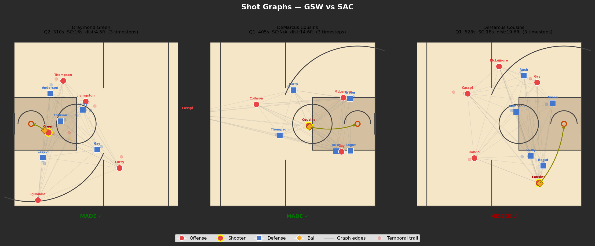
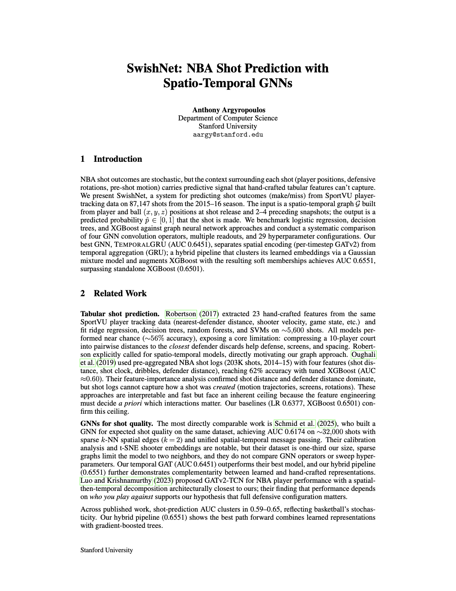
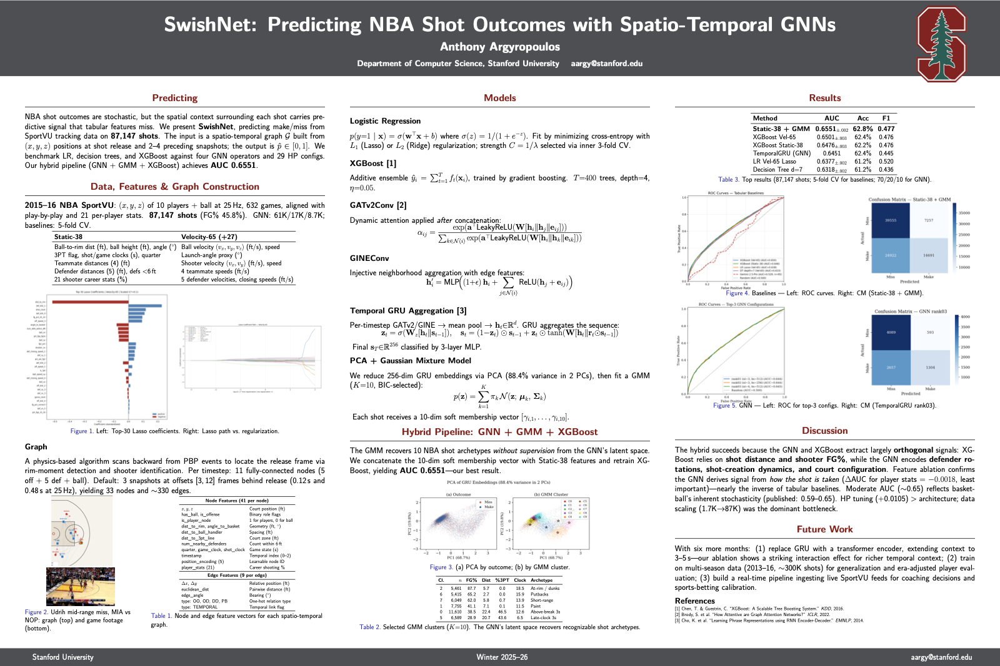
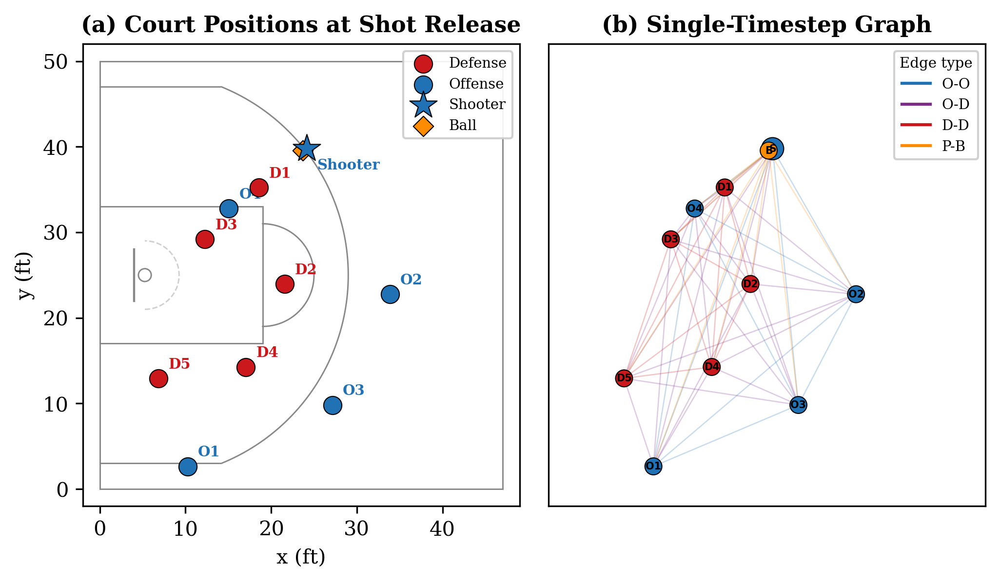

<div align="center">

# SwishNet 🏀

### Predicting NBA shot outcomes from raw player-tracking data with spatio-temporal Graph Neural Networks


**[📄 Full Report](report/swishnet_paper.pdf)** · **[🖼️ Poster](report/poster/Stanford_CS_Poster_Template__Landscape_/main.pdf)** · **[🔬 Research Log](RESEARCH_LOG.md)** · **[🧪 Experiment Catalog](EXPERIMENT_CATALOG.md)**

</div>

---



Can you tell whether a shot will go in from what the court *looks like* the moment it leaves the shooter's hands? SwishNet converts each of **87,147 shots** from the 2015–16 NBA season into a spatio-temporal graph — built from SportVU tracking data recording the (x, y, z) positions of all 10 players and the ball at 25 Hz across 632 games — and trains graph neural networks to find out. The project spans the full research arc: a physics-based shot-extraction pipeline, ~50 model configurations benchmarked, a hybrid GNN + XGBoost pipeline that beats both of its parts, and interpretability analyses showing *what* the network actually learned.

## Results

| Method | AUC | Accuracy | F1 |
|---|:-:|:-:|:-:|
| **Hybrid: XGBoost + GNN embedding clusters** | **0.6551 ± .002** | **62.8%** | **0.4773** |
| XGBoost (Velocity-65 features) | 0.6501 ± .003 | 62.4% | 0.4758 |
| XGBoost (Static-38 features) | 0.6476 ± .003 | 62.2% | 0.4763 |
| TemporalGRU GNN (HP-tuned) | 0.6451 | 62.4% | 0.4452 |
| Logistic Regression (Velocity-65, Lasso) | 0.6377 ± .002 | 61.2% | 0.5198 |
| Decision Tree (depth 7) | 0.6318 ± .002 | 61.2% | 0.4355 |
| Gemini 2.5-Pro (zero-shot sanity check) | 0.5287 | 54.7% | 0.0851 |

Published shot-prediction AUCs cluster in the **0.59–0.65** range — basketball is genuinely stochastic. The most directly comparable GNN work on the same tracking dataset reports AUC 0.6174; SwishNet's standalone GNN (**0.6451**) and hybrid pipeline (**0.6551**) both exceed it, evaluated on a dataset roughly 3× larger.

### Key findings

1. **Data quantity is the dominant bottleneck.** On a 1,745-shot subset no GNN beat logistic regression; scaling to 87K shots reversed the gap entirely.
2. **Separate spatial and temporal processing.** The best architecture (TemporalGRU) encodes each court snapshot with GATv2 attention layers, then aggregates snapshots with a GRU — beating unified spatio-temporal message passing.
3. **The GNN learns signal hand-crafted features can't express.** Feature ablations show it relies most on temporal ordering and geometry and *least* on player career stats — nearly the inverse of the tabular models. That orthogonality is exactly why the hybrid pipeline wins.
4. **Hyperparameter optimization was the single largest lever** for the GNN: +0.0105 AUC over defaults, found via a 29-configuration sweep.
5. **Unsupervised structure emerges** — see below.

### The GNN discovers shot archetypes on its own

Fitting a Gaussian Mixture Model (K = 10, selected by BIC) to the GNN's 256-dim shot embeddings recovers recognizable NBA shot types with **no supervision**:

| Cluster | Shots | FG% | Avg. distance | Shot clock | Interpretation |
|---|:-:|:-:|:-:|:-:|---|
| 2 | 5,461 | 87.7% | 5.7 ft | 18.5 s | At-rim finishes / dunks |
| 6 | 5,415 | 65.2% | 2.7 ft | 15.9 s | Uncontested putbacks |
| 0 | 11,610 | 38.5% | 22.4 ft | 12.6 s | Above-the-break threes |
| 5 | 6,589 | 28.9% | 20.7 ft | 6.5 s | Late-clock desperation threes |

The clusters capture context invisible to distance alone — two close-range clusters (2.7 ft vs. 3.9 ft) differ by over 20 points of FG% because one is putbacks and the other contested paint shots. Appending each shot's 10-dim soft cluster membership to the tabular features and retraining XGBoost yields the best overall AUC (0.6551).

## Report & poster

| [📄 Full report (PDF)](report/swishnet_paper.pdf) | [🖼️ Poster (PDF)](report/poster/Stanford_CS_Poster_Template__Landscape_/main.pdf) |
|:-:|:-:|
| [](report/swishnet_paper.pdf) | [](report/poster/Stanford_CS_Poster_Template__Landscape_/main.pdf) |

## How it works



**1. Shot extraction.** Play-by-play timestamps are coarse (often off by 1–3 s), so a physics-based algorithm locates each release: scan backward from the ball's rim arrival to find the flight trajectory, identify the shooter as the nearest offensive player when the ball left their hands, and validate against the play-by-play record. This yields 87,147 cleanly labeled shots (45.8% FG).

**2. Graph construction.** Each timestep becomes a fully-connected 11-node graph (5 offense, 5 defense, ball) with **41 node features** (position, distance to rim/defender, angle to basket, game clocks, position encoding, 21 career shooting stats) and **9 edge features** (relative position, distance, bearing, edge type). The default graph stacks 3 timesteps — release plus ~0.12 s and ~0.48 s earlier — giving 33 nodes and ~330 edges per shot.

**3. Model search.** Tabular baselines (logistic regression, decision trees, XGBoost on 38 static / 65 velocity-augmented features) are benchmarked against four GNN convolution operators (GATv2, GINE, GraphSAGE, EdgeConv), five readout strategies, multiple loss functions, a 29-config hyperparameter sweep, and a 2×2 factorial ablation over temporal density and horizon. The winner, **TemporalGRU**, runs shared GATv2 layers per timestep, pools each snapshot into an embedding, and feeds the sequence through a GRU into an MLP classifier.

**4. Hybrid pipeline.** GNN embeddings → PCA/GMM soft cluster memberships → appended to the static features → retrained XGBoost. Decoupling representation learning (the GNN) from classification (400 boosted trees) combines the strengths of both paradigms.

**Interpretability.** Three complementary analyses agree on what the network learned: feature-group ablation ranks temporal ordering and geometry as most important and player identity least; input-gradient saliency shows shooter and ball nodes receiving 3–4× larger gradients than other players; and GATv2 attention concentrates on player–ball edges and nearby defenders (edges under 6 ft receive ~35% more attention). The model centers its representation on the shooter–ball–defender triangle — *how* the shot is taken, not *who* is taking it.

## Repository tour

```
SwishNet/
├── colab/                        # All source code
│   ├── download_season_data.py   #   Download raw SportVU tracking data
│   ├── load_with_context.py      #   Physics-based shot-release extraction
│   ├── build_graph.py            #   Convert shots to PyTorch Geometric graphs
│   ├── train_baselines.py        #   LR / decision tree / XGBoost baselines
│   ├── train.py                  #   GNN training loop
│   ├── pipeline/                 #   GCP/GCS data pipeline utilities
│   └── phase2/                   #   Architecture comparison, HP sweep,
│                                 #   PCA/GMM hybrid, interpretability, LLM baseline
├── report/
│   ├── swishnet_paper.pdf        #   📄 Full write-up (NeurIPS style)
│   ├── figures/                  #   Publication figures
│   └── poster/                   #   🖼️ Poster source + PDF
├── RESEARCH_LOG.md               # Chronological log of every experiment
└── EXPERIMENT_CATALOG.md         # Structured index of all runs and results
```

The [research log](RESEARCH_LOG.md) and [experiment catalog](EXPERIMENT_CATALOG.md) document the full experimental process — every run, dead end, and design decision.

## Reproducing

```bash
pip install -r requirements.txt

python colab/download_season_data.py   # 1. Download 2015-16 SportVU tracking data
python colab/load_with_context.py      # 2. Extract shots + context from raw tracking
python colab/build_graph.py            # 3. Build PyTorch Geometric graphs
python colab/train.py                  # 4. Train a GNN (config at top of file)
```

Baselines and the full experiment suite live in `colab/train_baselines.py` and `colab/phase2/` (hyperparameter sweep, graph-variant ablations, PCA/GMM hybrid, interpretability analyses). Large-scale runs were executed on GCP VMs; see `setup_gcp.sh` and `colab/pipeline/`.

## Data sources

- [NBA SportVU tracking data, 2015–16 season](https://github.com/linouk23/NBA-Player-Movements) — 25 Hz (x, y, z) for all players + ball
- NBA play-by-play logs (Kaggle) — shooter identity, make/miss labels
- [Basketball Reference](https://www.basketball-reference.com/) — per-player season shooting statistics

## Author

**Anthony Argyropoulos** — Department of Computer Science, Stanford University
